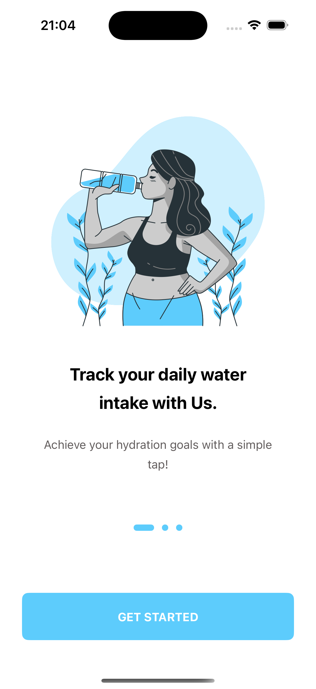
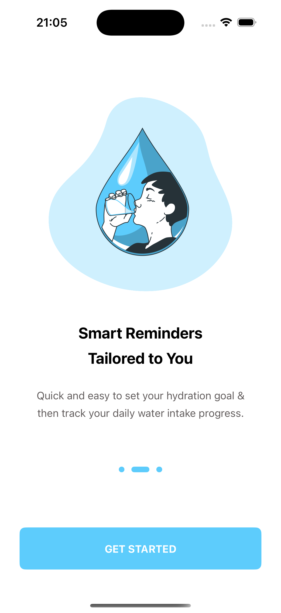
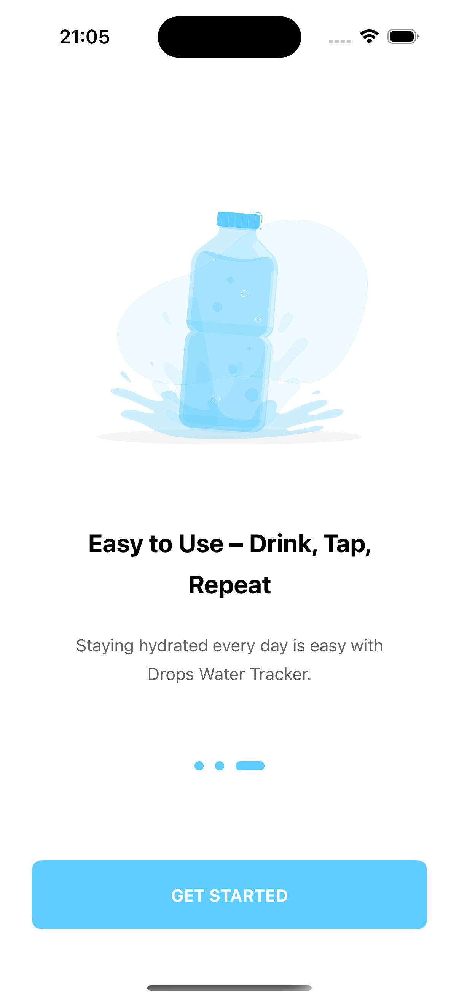
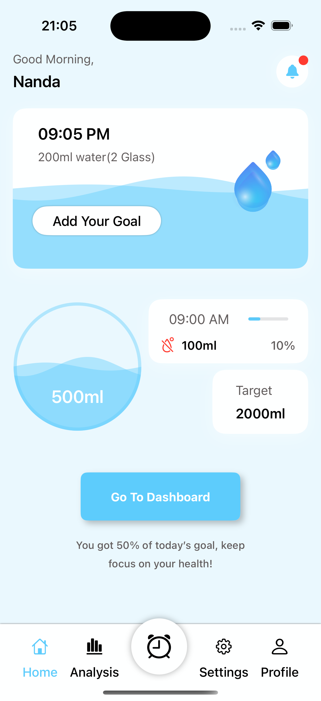
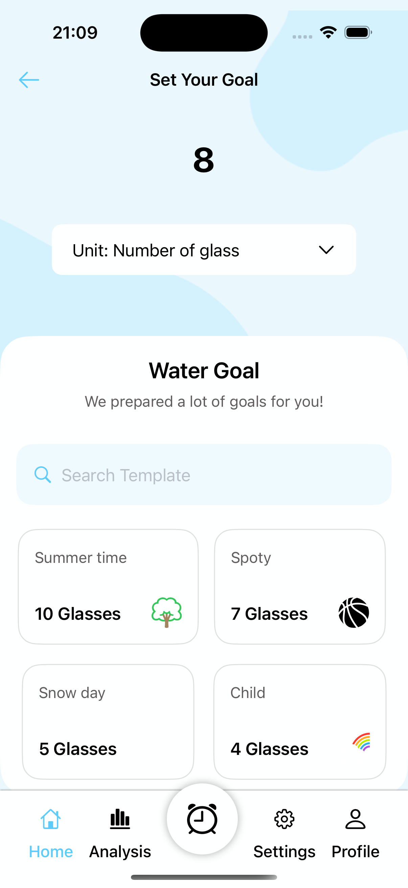
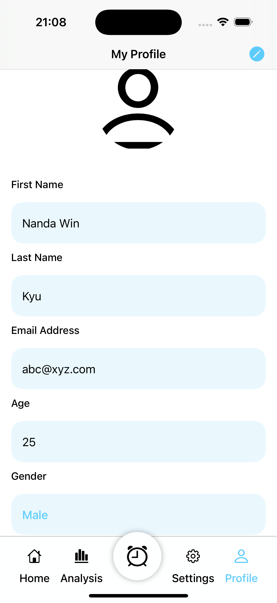
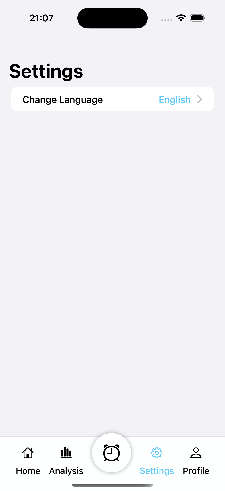
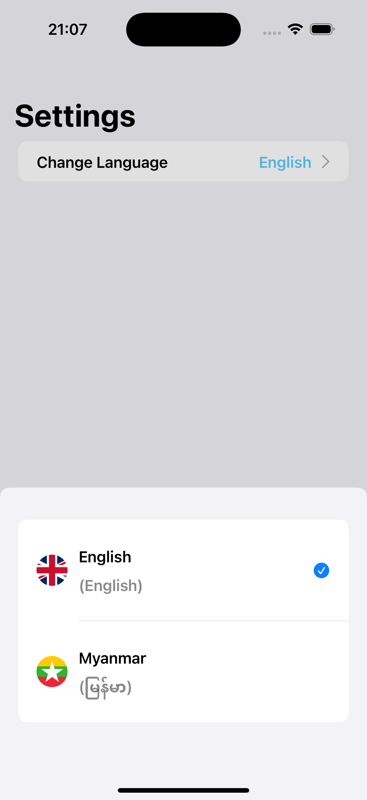
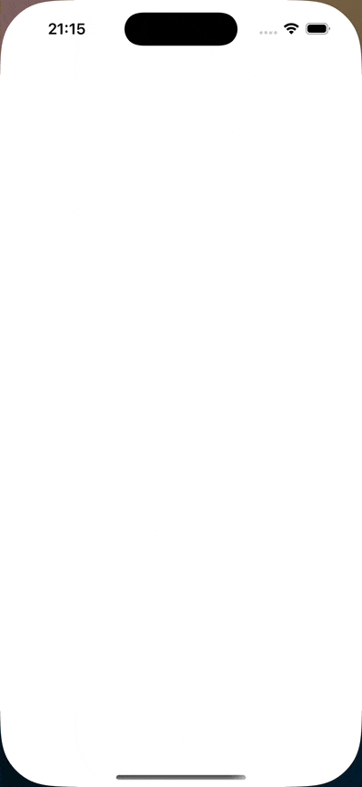

# WaterTracker

WaterTracker is a simple SwiftUI-based iOS application that allows users to track their daily water consumption. This project is focused on showcasing SwiftUI skills, implementing custom views, and ensuring maintainable project structure. It includes localization support for the Myanmar language. 

## Features

- SwiftUI-based interface.
- Localization support for Myanmar.
- Custom view components for reusable and clean UI elements.
- Track your daily water consumption (UI only, no business logic implemented).

## Screenshots

Here are some screenshots showcasing the UI of the WaterTracker app:

| Onboarding 1            | Onboarding 2          | Onboarding 3             |
|-------------------------|--------------------------|-----------------------|
|  |  |  |

| Main Screen             | Analysis                 | Profile               |
|-------------------------|--------------------------|-----------------------|
|  |  |  |

| Set Goal                | Settings                 | Settings              |
|-------------------------|--------------------------|-----------------------|
|  |  |  |

## App Demo

Check out this GIF to see the app in action:



## Localization

WaterTracker supports localization for the Myanmar language. To change the language of the app, simply navigate to the Settings page and choose Myanmar from the language options.

## How to Run

To run the project:

1. Clone the repository:
   ```bash
   git clone https://github.com/nanda-wk/WaterTracker.git
2. Open the project in Xcode.
3. Select the appropriate simulator or a physical device.
4. Build and run the app.

## Credits

The UI design for this app was taken from a Figma Community project. You can find the original design here:

[Water Tracker App - Water Drink Reminder App UI Design](https://www.figma.com/community/file/1266627526891422058/water-tracker-app-water-drink-reminder-app-ui-design)


